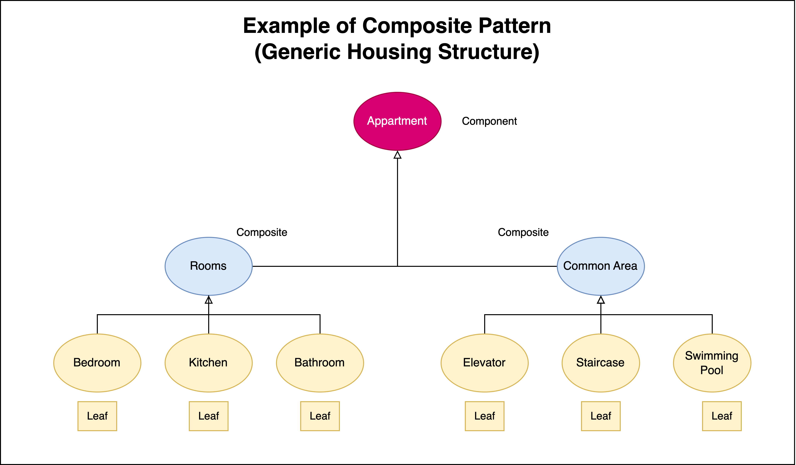
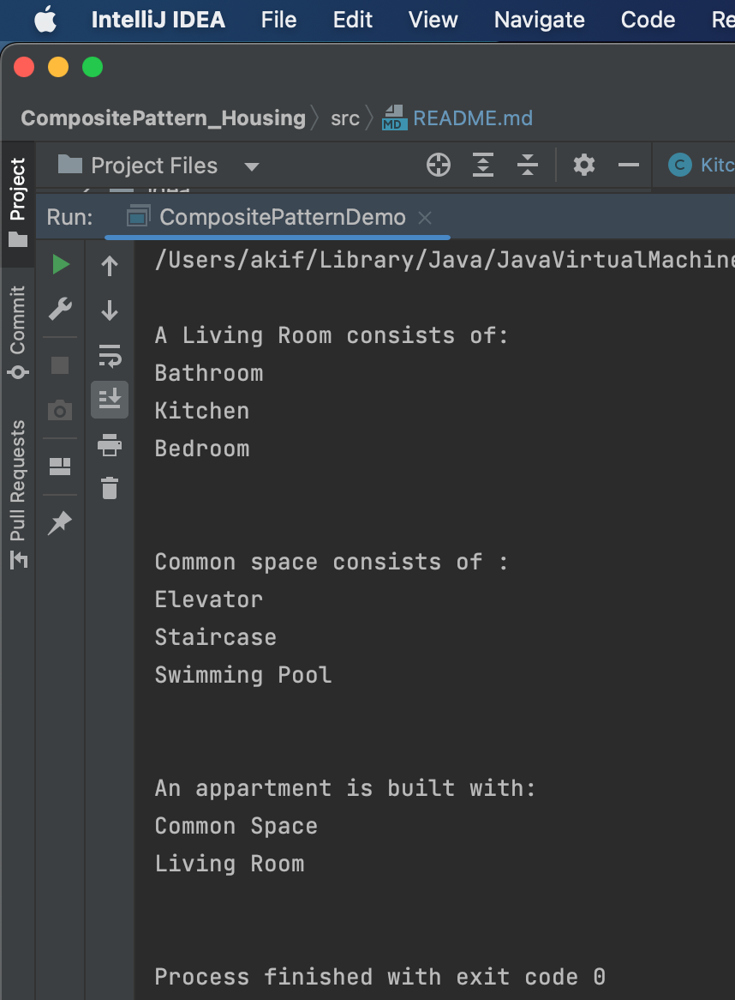

# A demonstration of Composite Design Pattern

# Course Title : Object Oriented Design and Design Patterns Lab(CSE 4122)
## Author
Akif Islam<br>
Department of CSE, University of Rajshahi<br>
iamakifislam@gmail.com<br><br><br>

## Experiment 04
<p>Write a Java program to demonstrate the implementation of a composite design pattern by using an example with a building composed of generic housing structures.</p>

## Story of the Program
<p>
This design pattern follows the basic component-composite-leaf model of Composite Design Pattern. 
</p>

## Class Diagram




## How to Run?
```bash
  $javac CompositePatternDemo.java
  $java CompositePatternDemo
```


## Composite Pattern Demo Program
```java
// Creating Leaf Node : Bathroom, Kitchen and Bedroom
Bathroom bathroom = new Bathroom();
Kitchen kitchen = new Kitchen();
Bedroom bedroom = new Bedroom();

// Sending Bathroom, Kitchen, Bedroom to its Composite Class ---> Living Room
LivingRoom livingRoom = new LivingRoom();
livingRoom.addRoom(bathroom);
livingRoom.addRoom(kitchen);
livingRoom.addRoom(bedroom);
livingRoom.getSubordinates();

// Creating Leaf Node : Elevator, Staircase and Swimming Pool
Elevator elevator = new Elevator();
Staircase staircase = new Staircase();
SwimmingPool swimmingPool = new SwimmingPool();

// Sending Elevator, Staircase, Swimming Pool to its Composite Class ---> Common Area
CommonArea commonArea = new CommonArea();
commonArea.addRoom(elevator);
commonArea.addRoom(staircase);
commonArea.addRoom(swimmingPool);
commonArea.getSubordinates();

Appartment appartment = new Appartment();
appartment.addRoom(commonArea);
appartment.addRoom(livingRoom);
appartment.roomInfo();

```

## Output



